# OwnCloud

# Configuracion de OwnCloud

Para configurar nuestro OwnCluod tendremos que poner la IP que hemos obtenido de nuestra maquina con el comando `ip -c a`, en nuestro navegador y nos llevara al la pagina de nuestro Owncloud y iniciaremos sesión.

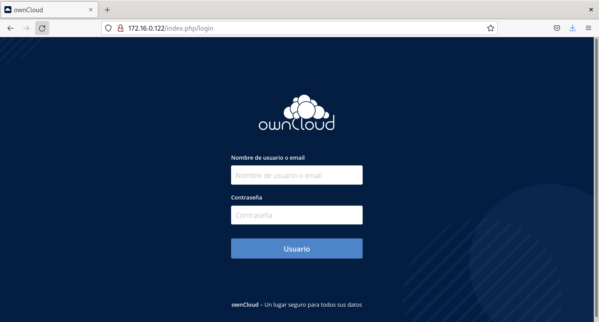

Le daremos clic al nombre de nuestro perfil a la opción `usuarios`.

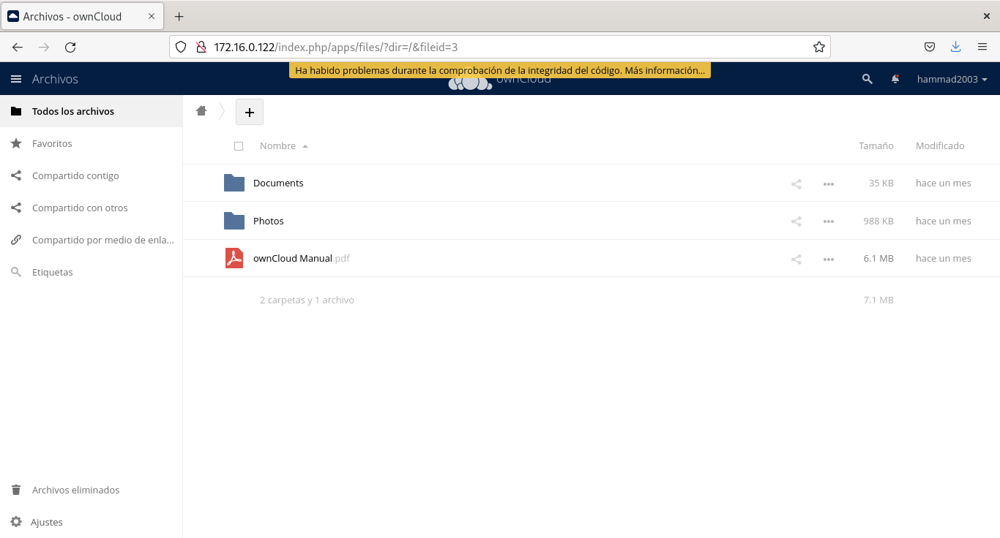

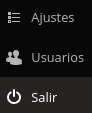

Justo arriba de nuestro usuario hay una fila donde tendremos que rellenar con datos para el nuevo usuario que vamos a crear, una vez rellenado los datos le daremos clic a crear.

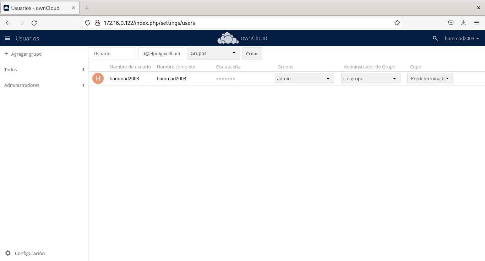

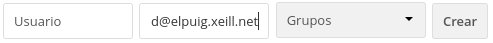

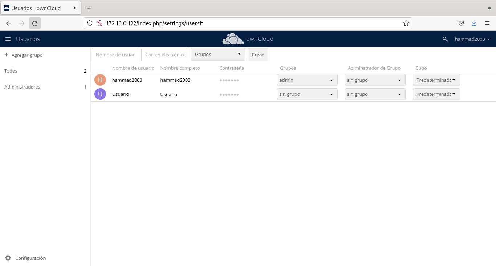

Una vez ya creado el usuario procedemos a crear un grupo, para ello le daremos clic a `agregar grupo` y lo nombras como queramos .

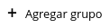

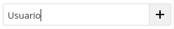

Una vez ya creado el usuario y el grupo le cambiaremos las preferencias "características y roles" es decir `cupas`, `administracion de gruop` y `grupos`.

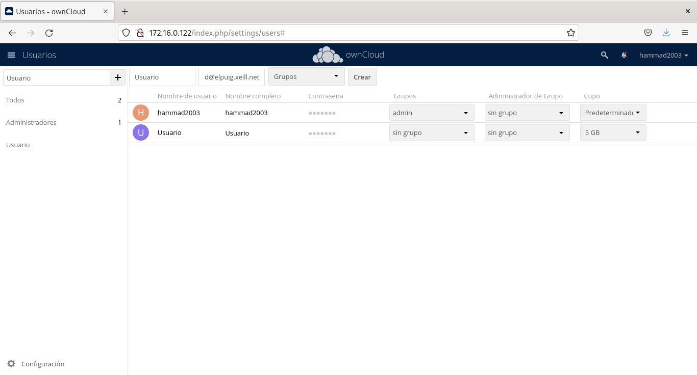

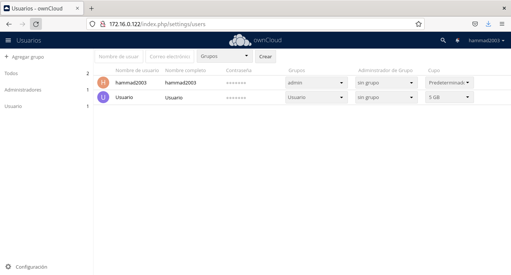

Cuando ya hayamos cambiado las preferencias comprobamos que se hayan realizado, en este caso le hemos asignado al grupo de `Usuario`y le hemos dado una capacidad de `5GB` en cupa, entonces esto lo comprobamos dirigiendo nos al grupo `Usuario` para ver si esta allí nuestro `usuario` con su respectiva capacidad de 5GB.

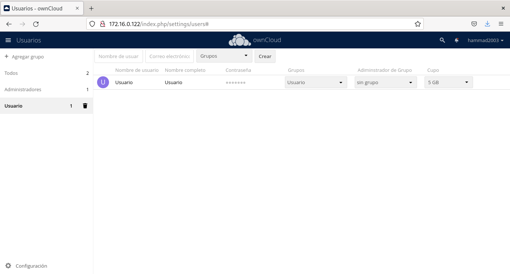

Una vez ya comprobado todo le daremos clic a las 3 barritas y le daremos clic a `archivos`.

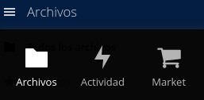

Una vez en archivos nos saldrá esta pagina y le daremos clic al icono del `+`.

Al hacer clic nos saldrá esta pequeña pestaña y al lado del icono de carpeta, nombraremos nuestra carpeta como queramos.

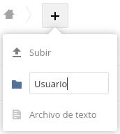

Una vez ya creada la carpeta le daremos clic a la opción de `compartido`.

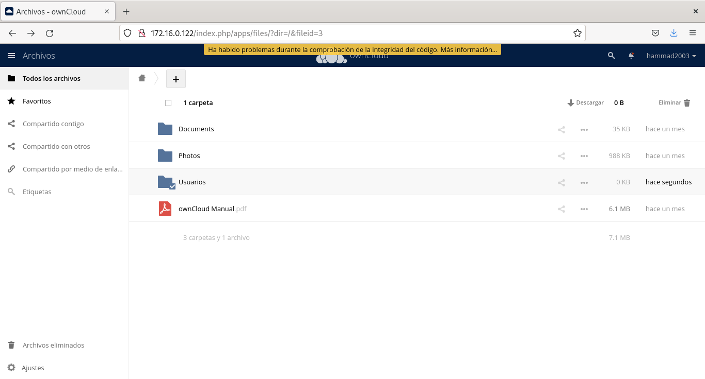

Al dar le clic nos saldrá un pequeña venta a la derecha y le daremos clic a la opción de `compartiendo` y dentro de la opción compartiendo le daremos a la opción `Usuarios y grupos` y allí escribimos el nombre de nuestro grupo o de nuestro usuario que anteriormente hemos creado, en este caso añadimos el grupo Usuario y le asignamos los permiso que queramos, en mi caso le he dado todos los permisos que básicamente serian los siguientes, `puede compartir`, `puede editar`, `crear`, `cambio`, `eliminar`.    

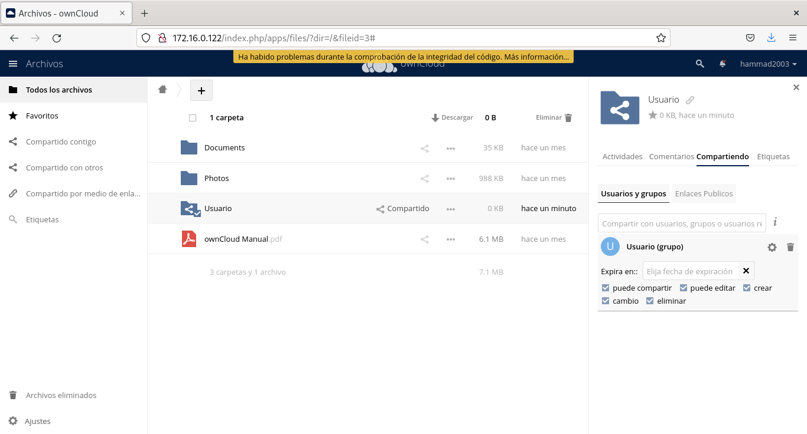

Esto seria una de las maneras de configurar nuestro `Owncloud`.
